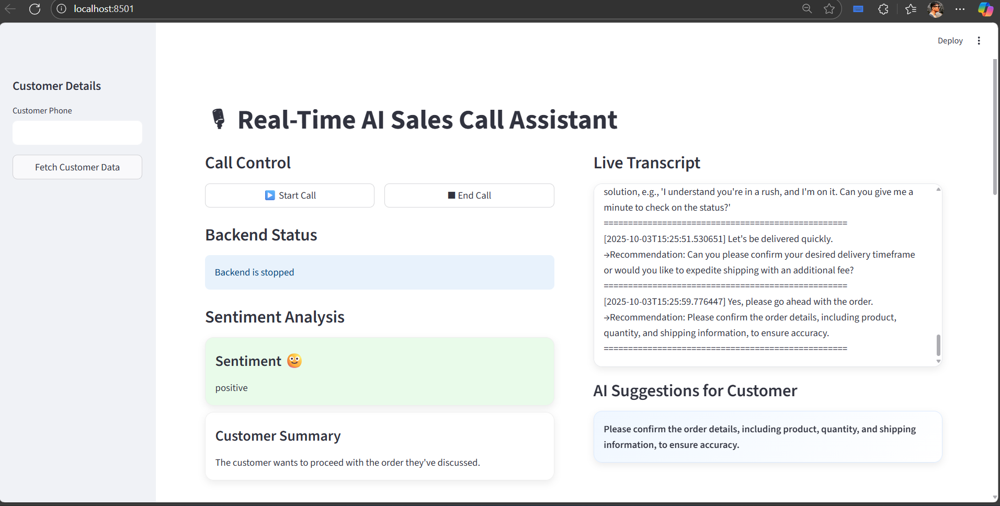
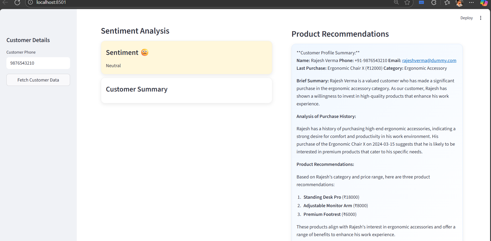
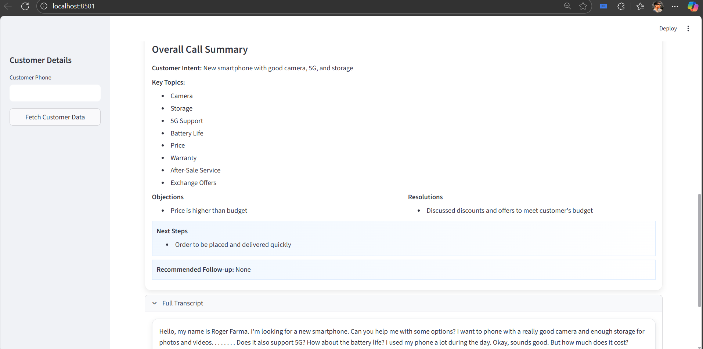
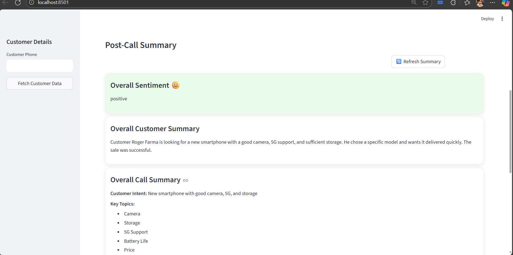

# Fast Whisper – Optimized Speech-to-Text System

Fast Whisper is an **optimized, faster, and memory-efficient implementation** of OpenAI’s Whisper Automatic Speech Recognition (ASR) model.  
It delivers **real-time transcription** performance while retaining Whisper’s **multilingual accuracy** and **robust handling of accents**.

---

## 🚀 What is Fast Whisper?

- Converts Whisper models into **CTranslate2** or **Faster-Whisper** format for optimized CPU/GPU inference.
- Provides **streaming transcription** for **low-latency applications**.
- Runs efficiently on **CPU, GPU, and Apple Silicon (M1/M2)** hardware.
- Fully **open-source** and **customizable**.

---

## 💡 Why Use Fast Whisper?

OpenAI’s original Whisper model is **accurate but computationally heavy**. Fast Whisper solves this by:

- **Reducing latency** → ideal for live captions and call transcription.
- **Lowering resource usage** → runs even on laptops, mobile devices, or Raspberry Pi.
- **Cost efficiency** → less hardware required compared to standard Whisper.

**Perfect for:**

- Real-time meeting transcription
- Sales call analytics
- Live captions for webinars or broadcasts
- Edge deployments where power consumption is critical

---

## ⚙ How Does It Work?

1. **Model Optimization** – Converts Whisper models into an efficient inference engine using CTranslate2.
2. **Quantization** – Uses **int8/int16 precision** instead of FP32 to reduce memory usage and speed up processing.
3. **Streaming Support** – Processes audio in **small chunks** for low-latency transcription.
4. **Hardware Utilization** – Optimized for **CPU/GPU acceleration** without requiring expensive hardware.

---

# AI Sales Model: Real-Time Speech Transcription, Sentiment Analysis, and Google Sheets Logging

This project records audio in real-time, transcribes speech using a Whisper model, analyzes sentiment using the Groq API, and logs the results to a Google Sheet. The workflow is modular, with separate files for audio handling, transcription, sentiment analysis, and Google Sheets integration.

---

## Features

- **Real-time audio recording** using your microphone
- **Automatic speech transcription** with [faster-whisper](https://github.com/SYSTRAN/faster-whisper)
- **Sentiment analysis** via the Groq API (Llama-3.1-8b-instant)
- **CRM Integration** - Fetch customer data from CSV and generate AI-powered recommendations
- **Product Recommendations** - AI-generated product suggestions based on customer history
- **Automatic logging** of transcript, sentiment, and summary to Google Sheets
- **Auto-stop** after configurable silence duration

---

## Project Structure

```
AI_sales Model/
│
├── app.py                # Streamlit web interface
├── audio.py              # Audio recording and silence detection
├── whisper_model.py      # Whisper model loading and transcription
├── sentiment.py          # Sentiment analysis via Groq API
├── sheet.py              # Google Sheets integration
├── crm_functions.py      # CRM data fetching and AI recommendations
├── main.py               # Main integration script
├── CRM_data.csv          # Customer data for CRM integration
├── requirements.txt      # Python dependencies
├── credentials.json      # Google Service Account credentials (not included)
├── .env                  # Environment variables (GROQ_API_KEY)
└── README.md             # Project documentation
```

---

## Setup Instructions

### 1. Clone the Repository

```sh
git clone https://github.com/vinit-4209/AI_sales-Model.git
cd AI_sales Model
```

### 2. Create and Activate a Virtual Environment

```sh
python -m venv .venv
.venv\Scripts\activate
```

### 3. Install Dependencies

```sh
pip install -r requirements.txt
```

### 4. Set Up Environment Variables

Create a `.env` file in the project root with your Groq API key:

```
GROQ_API_KEY=your_groq_api_key_here
```

### 5. Set Up Google Sheets Credentials

- Create a Google Cloud project and enable the Google Sheets API.
- Download your `credentials.json` and place it in the project root.
- Share your target Google Sheet with the service account email.

---

## Usage

### Web Interface (Recommended)

Run the Streamlit app:

```sh
streamlit run app.py
```

1. **Customer Details**: Enter customer name, phone, and email in the sidebar
2. **Fetch Customer Data**: Click "🔍 Fetch Customer Data" to get CRM information
3. **View Recommendations**: See AI-generated product recommendations based on customer history
4. **Start Call**: Use the call control buttons to start/stop recording
5. **Live Analysis**: View real-time transcription and sentiment analysis

### Command Line Interface

Run the main script:

```sh
python main.py
```

- Speak into your microphone.
- The script will transcribe your speech, analyze sentiment, and log results to your Google Sheet.
- The process will automatically stop after 15 seconds of silence (configurable in `main.py`).

## CRM Integration

The system now includes CRM functionality:

1. **Customer Data Fetching**: Enter a phone number to fetch customer data from `CRM_data.csv`
2. **AI-Powered Analysis**: Uses Groq's Llama-3.1-70b model to analyze customer history
3. **Product Recommendations**: Generates personalized product suggestions based on:
   - Previous purchase history
   - Product category preferences
   - Price range analysis
   - Upselling/cross-selling opportunities
4. **Sales Insights**: Provides key talking points and customer profile summary

---

## Configuration

You can adjust these parameters in `main.py`:

- `SILENCE_THRESHOLD`: Sensitivity for silence detection
- `SILENCE_SECONDS`: Duration of silence before auto-stop
- `sample_rate`, `block_duration`, `chunk_duration`: Audio processing settings

---

## Requirements

- Python 3.8+
- [faster-whisper](https://github.com/SYSTRAN/faster-whisper)
- sounddevice
- numpy
- requests
- python-dotenv
- gspread
- oauth2client

All dependencies are listed in `requirements.txt`.

---

## License

This project is for educational and demonstration purposes.

---

## DEMO Purpose
## Live Transcription & Suggestions


## Product Recommendation


## Overall Post-Call Summary




## Acknowledgements

- [faster-whisper](https://github.com/SYSTRAN/faster-whisper)
- [Groq API](https://console.groq.com/)
- [Google Sheets API](https://developers.google.com/sheets/api)
